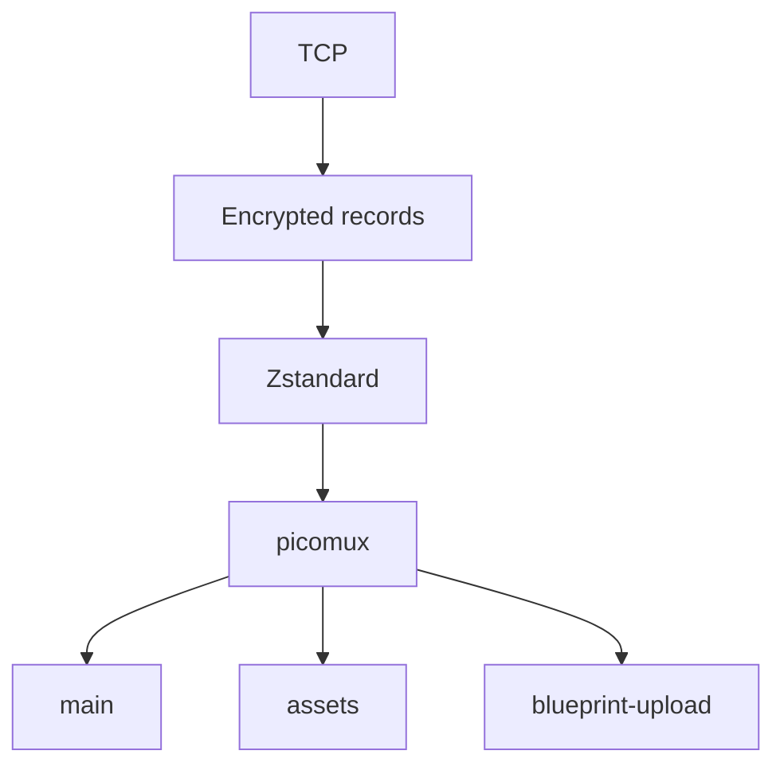
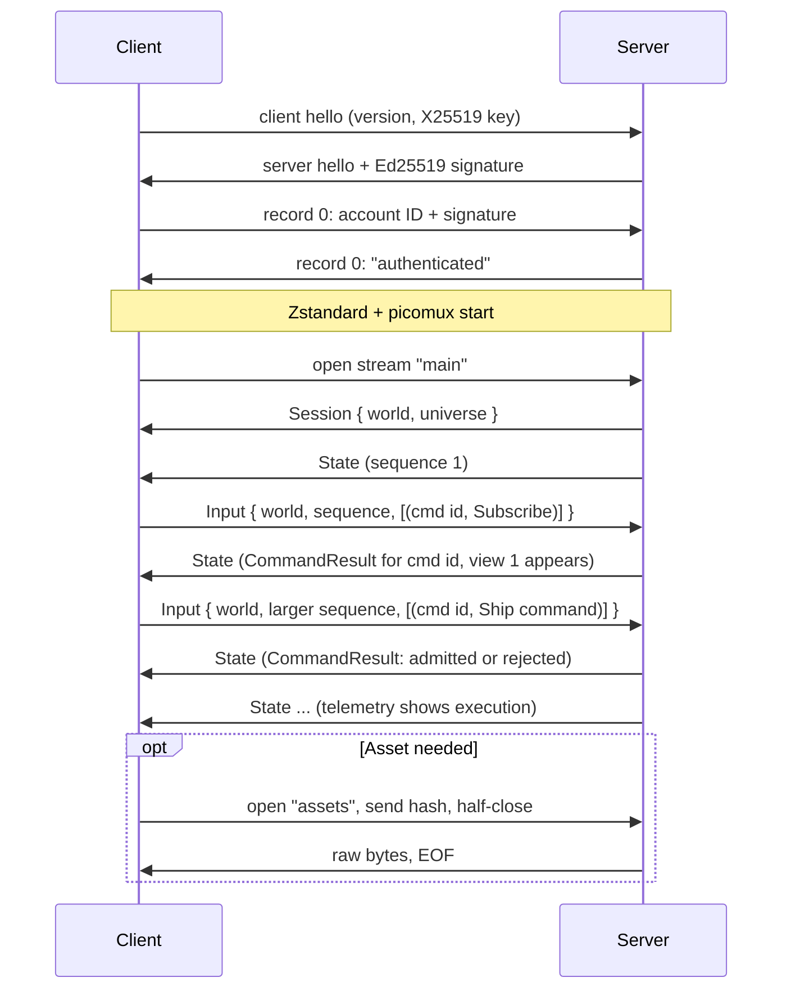
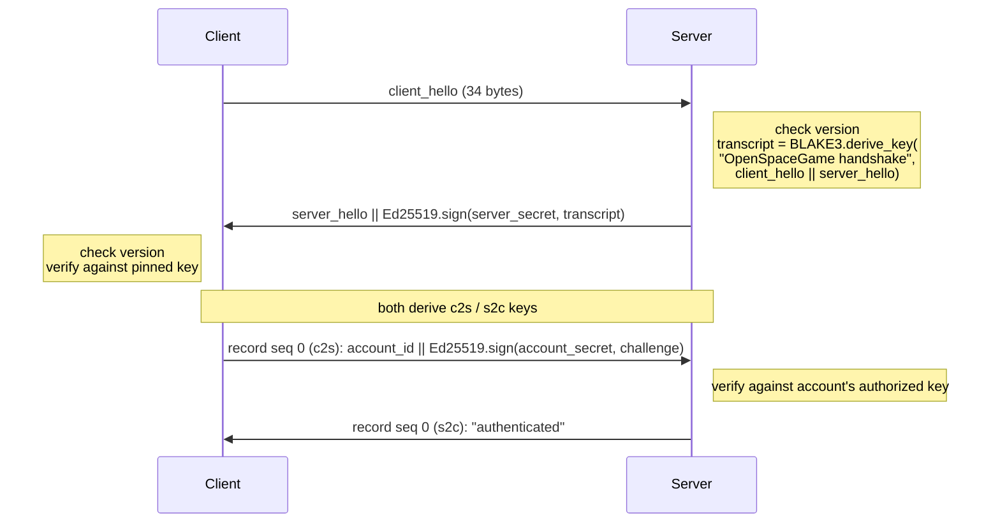
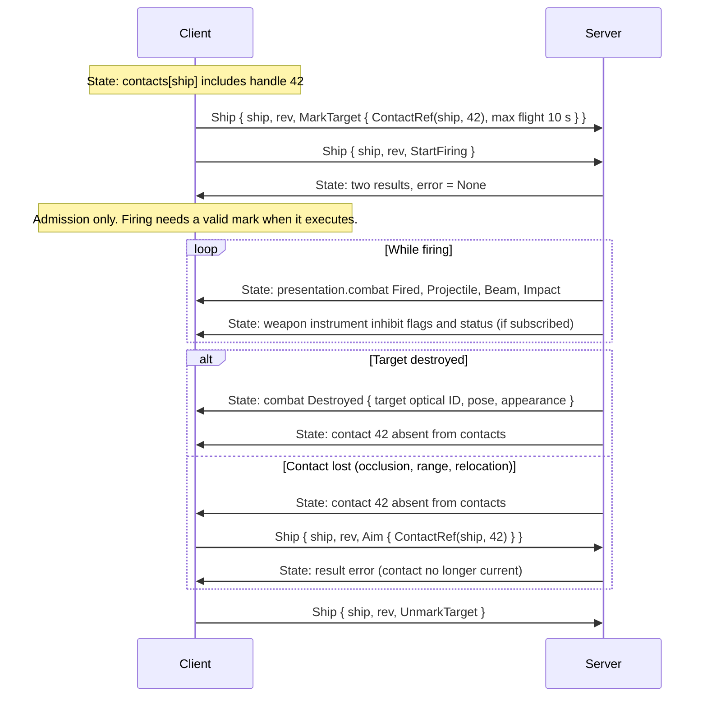
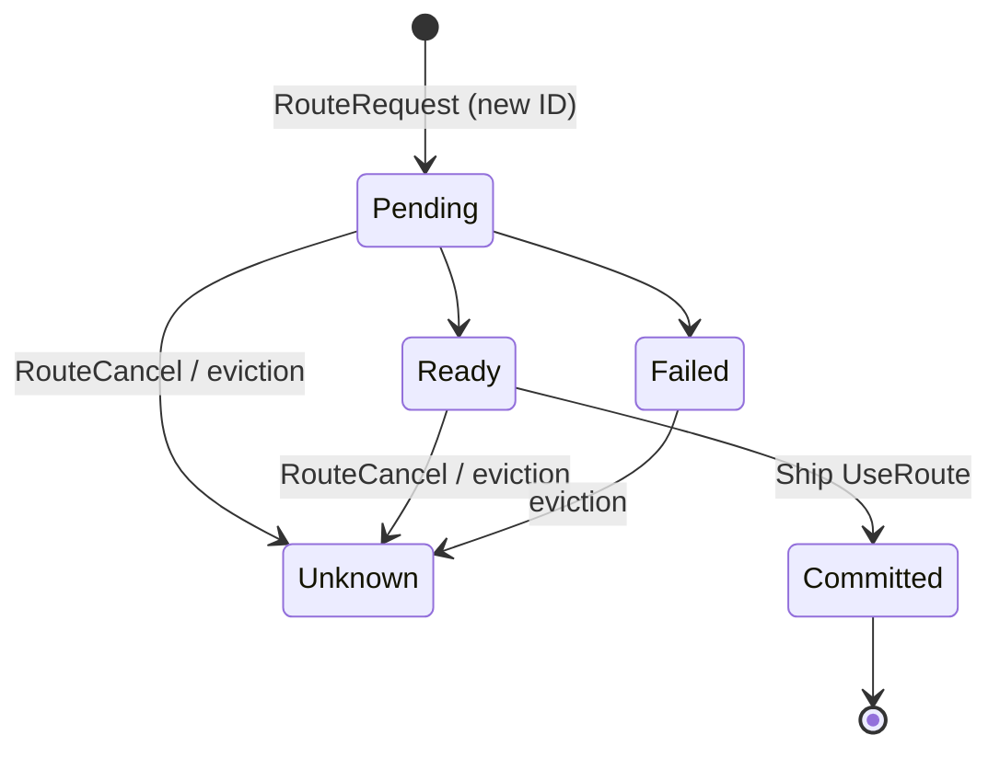
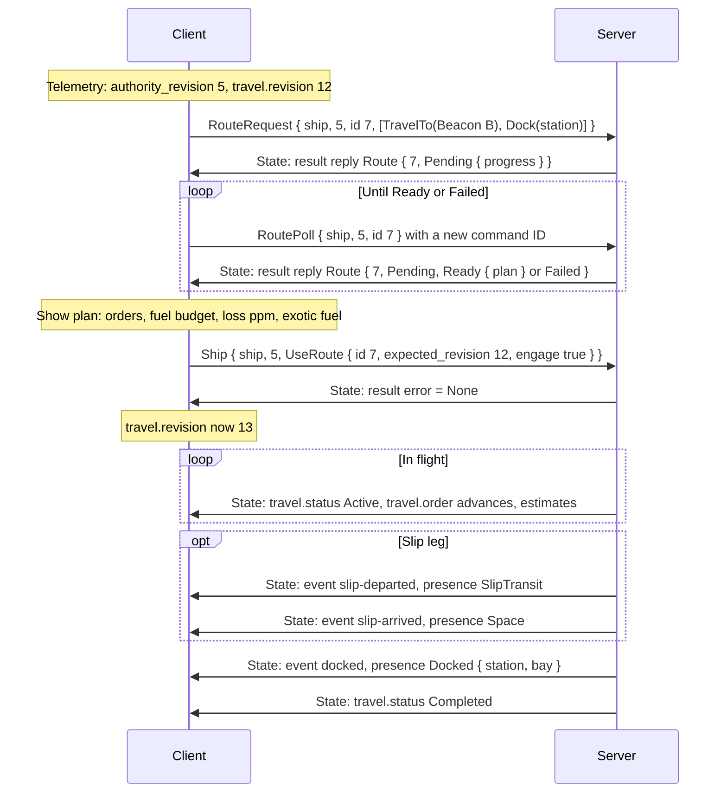
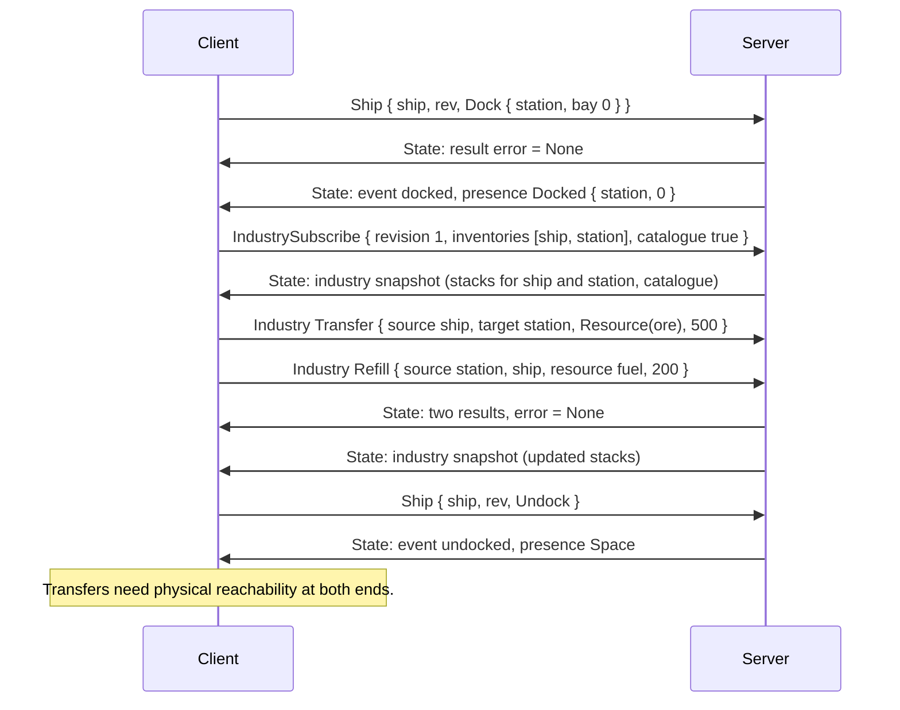
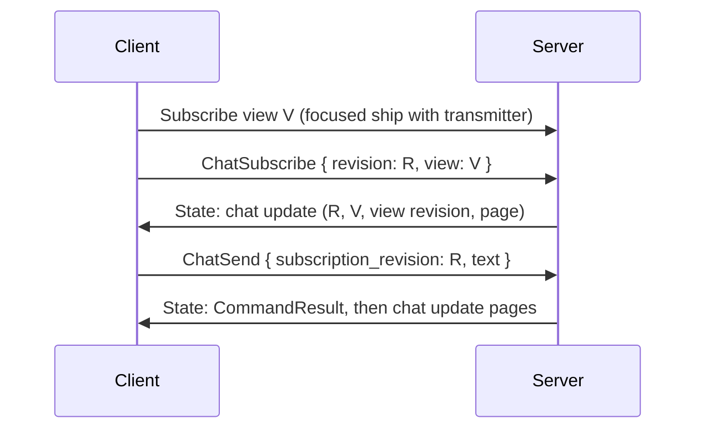
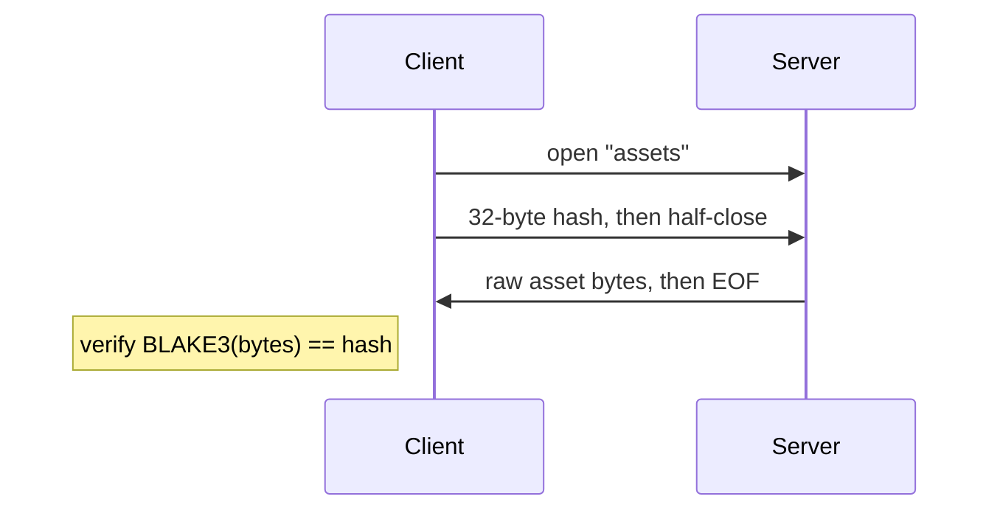
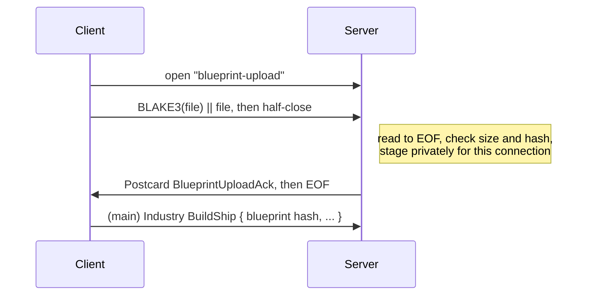

# Network protocol, version 49

This specification defines the bytes and observable behavior needed to build an
independent server or client. It is accompanied by:

- [the schema reference](protocol-schema.md): every payload type, field order
  and enum tag, also available as a standalone [Serde schema](protocol-schema.rs);
- [conformance examples](protocol-vectors.md): concrete encodings and a
  deterministic handshake.

This document explains what those bytes mean and what each side must do with
them. It is organized from the outside in:

| Part | Contents |
| --- | --- |
| [Overview](#overview) | Scope, the layer stack, a session walkthrough, and the core vocabulary |
| [Conventions](#conventions) | Versioning, byte order, Postcard usage, identifiers, coordinates, units |
| [Connection setup](#connection-setup) | Handshake, encrypted records, compression, multiplexing, streams |
| [The main stream](#the-main-stream) | Message framing, session lifecycle, inputs, results, state frames, failures |
| [Authorization](#authorization) | Who may observe or command what |
| Feature chapters | [Views and observation](#views-and-observation), [Ships](#ships), [Instruments and displays](#instruments-and-displays), [Society](#society), [Industry and cargo](#industry-and-cargo), [Local chat](#local-chat), [Debug](#debug) |
| [Side streams](#side-streams) | Asset downloads, asset formats, blueprint upload and the `.ship` format |
| Appendices | [A: Input validation](#appendix-a-input-validation), [B: Limits](#appendix-b-limits), [C: Numeric codes](#appendix-c-numeric-codes) |

Each feature chapter follows the same order: what the client sends, what the
server checks, and how the result appears in State. Numeric limits appear in
[Appendix B](#appendix-b-limits) rather than in the chapters.

---

## Overview

### Scope

An implementation may choose its language, engine, storage, scheduling,
simulation algorithms and presentation. Conformance requires the encodings,
message direction, authorization, ordering and update semantics specified here.

Game outcomes such as motion, damage, production, docking admission and route
selection are server decisions. An alternative server supplies its own game
decisions while preserving how their results are reported. Shared universe
generation is outside this specification; the universe descriptor and celestial
references are included only as wire data.

Credential discovery and account registration are also out of scope. Before
connecting, a client must already have:

- the server's TCP address,
- the server's pinned Ed25519 public key,
- its authenticated account ID, and
- that account's Ed25519 signing key.

### Layer stack

Each connection is one TCP stream carrying these layers, outermost first:



| Layer | Role | Section |
| --- | --- | --- |
| TCP | One bidirectional byte stream per connection | — |
| Encrypted records | Plaintext hellos, then ChaCha20-Poly1305 records with one sequence counter per direction | [Handshake](#handshake), [Encrypted records](#encrypted-records) |
| Zstandard | One continuous compression stream per direction, starting after authentication | [Compression](#compression) |
| picomux | Independently half-closable logical streams | [Multiplexing](#multiplexing) |
| `main` | Length-prefixed Postcard Messages for the whole session | [The main stream](#the-main-stream) |
| `assets` | Send a hash, receive raw bytes | [Asset downloads](#asset-downloads) |
| `blueprint-upload` | Send a file, receive a Postcard acknowledgement | [Blueprint upload](#blueprint-upload) |

TCP reads, encrypted records, compressed chunks, mux frames and application
messages all have independent boundaries. At every layer, accumulate exact
lengths and handle both fragmentation and coalescing.

### A session at a glance



The minimal useful exchange is:

1. Authenticate, start compression and multiplexing, and open `main`.
2. Receive Session and its first State. From telemetry and the society snapshot,
   read the observable ship IDs, their authority revisions and your permissions.
3. Send an Input with that world, a sequence number, and a fresh command ID for
   `Subscribe { id: 1, revision: 1, focused_ship: Some(ship) }`.
4. Keep reading. The next result reports admission or an error. Subsequent State
   messages contain view 1 and its observations. Download appearance and
   directory hashes on separate streams as needed.
5. To control the ship, send another Input with a larger sequence, a fresh
   command ID, the current authority revision and a Ship command. Treat its
   result separately from later telemetry showing that it executed.
6. On a new Session, discard old session state, wait for new authority facts
   and subscribe again. On disconnect, reconnect and authenticate again.

Servers can publish empty collections and reject unauthorized or unavailable
operations while still supporting this exchange. Clients may implement only the
user features they need, but must decode the complete version-49 message schema
to locate every field, and must preserve the update semantics of what they
consume.

### Core vocabulary

| Term | Meaning |
| --- | --- |
| World | One simulation instance, named by an `Id` in `Session`. A debug reset creates a new world on the same connection. |
| Session | The application state of one authenticated connection within one world. Reconnection or a world change starts a new one. |
| Input sequence | Client-chosen, strictly increasing number on each Input. |
| State sequence | Server-assigned number on each State publication, starting at 1. Independent of input sequences. |
| Command ID | Client-chosen `Id` attached to each action. It deduplicates the action and matches it to its `CommandResult`. |
| View | A numbered, client-revised observation subscription, optionally focused on a ship. Optical visibility and local chat belong to views. |
| Authority revision | Per-ship counter published in telemetry. Ship and route actions must carry the current value. |
| Travel revision | Per-ship counter for the travel queue, used for optimistic concurrency by `SetTravel` and `UseRoute`. |
| Contact handle | Observer-local nonzero `u64` naming one of a ship's sensor detections. It is addressed with a `ContactRef`. |
| Optical ID | Opaque, session-scoped `Id` for a visible object within a view. |
| Spatial lifetime | A continuous period of existence in space, named by a `spatial_instance` token. |
| Principal | An account, organization or sovereignty that can own assets or receive grants. |

---

## Conventions

### Version

The handshake version is the unsigned 16-bit value **49**. It selects this entire
specification, including enum tags, field order and asset formats. There is no
feature negotiation, per-message version, optional trailing field or extension
tag space. A different handshake version terminates the connection.

### Notation and byte order

- Every fixed-width integer defined by this protocol is big-endian (network byte
  order). `BE16`, `BE32` and `BE96` mean unsigned integers in 2, 4 and 12 bytes.
- `||` means byte concatenation.
- Literal strings used in cryptography and stream metadata are exact UTF-8
  bytes with no terminator.
- KiB and MiB are powers of 1024.
- Text limits count UTF-8 bytes unless they explicitly count characters.
- Numeric intervals are inclusive unless stated otherwise.

Postcard payloads and picomux frames use their own encodings, independent of
these rules.

### Postcard usage

Application payloads use **Postcard 1.x**, as implemented by 1.1.3, and are
treated as a black box, like picomux. The [schema](protocol-schema.md) gives
declaration order and enum tags. Rust-style names and module paths in the schema
are documentation only and are never transmitted. This protocol adds these rules:

- **Ordered collections.** Maps and sets contain unique keys or elements in
  ascending order. IDs and strings compare lexicographically, enum keys compare
  by variant index then fields, and tuple keys compare lexicographically.
  Collection names in the schema describe ordering, not a required in-memory
  container.
- **Erased wrappers.** Shared-ownership wrappers have no bytes and are already
  erased in the schema. The travel order index is shown as `u64` and is bounded
  by the queue length.
- **No extensibility.** Producers use minimal varints. Postcard tolerates
  nonminimal varints within a type's width, but they must never be used to
  extend fields or negotiate features. Unknown enum variants, invalid
  booleans or options, invalid UTF-8, integer overflow and missing fields fail
  decoding.
- **Exact values.** Consumers parse the complete defined value. Trailing bytes
  have no meaning, and producers must not send them.
- **Bounded allocation.** Check that collection counts fit the message limits
  before allocating.

### Identifiers and hashes

`Id`, `AccountId` and `EntityId` are 16 raw bytes, with no length prefix. UUID
text maps to bytes in order, with no endian swap:
`00112233-4455-6677-8899-aabbccddeeff` is `00 11 22 … ee ff`.

Hashes are 32 raw BLAKE3 bytes, with no length prefix. Hexadecimal is only a
display convention.

### Coordinates and orientation

**Positions.** `GalacticPosition` is x, y, z as signed 128-bit **micrometres**.
The global frame is right-handed ICRS Cartesian, centred on Sol:

- +X toward right ascension 0, declination 0;
- +Y toward right ascension 90°, declination 0;
- +Z toward the north celestial pole.

Despite its name, `GalacticPosition` means global position and does not imply
Galactic sky axes. Everything in this document described as "galactic" uses
this global frame. Subtract integer positions before converting to floating-point
metres. Relative destination offsets use the same micrometre representation.
Client-supplied coordinates must satisfy `abs(coordinate) <= 2^110`.

**Orientation and motion.**

- Pose rotation is an x, y, z, w unit quaternion that transforms body-local
  vectors into galactic coordinates.
- Velocity is galactic metres per second. Angular velocity is radians per second
  in galactic coordinates.
- Ship assembly axes use forward −Z and up +Y. `control_rotation` maps control
  axes to assembly axes.
- An appearance part's position and rotation are relative to the ship pose origin.
- `inertia_kg_m2` is a 3×3 matrix in column-major order.
- Forces and torques in propulsion telemetry are ship-local. Rated torque
  capacities are in control axes.
- Directions in targeting commands are galactic.
- Angles and angular errors are radians.

### Units and time

Field suffixes give physical units: `_m`, `_m_s`, `_kg`, `_m3`, `_j`, `_w`, `_k`,
`_pa`, `_s`, `_ns`.

- `sim_time_ns` and presentation times are unsigned simulation nanoseconds.
- One tick is **100,000,000 ns** of simulation time. Tick counters are not
  calendar timestamps.
- `rate` is simulation speed relative to wall time, and is positive.
- `calendar_unix_ms` is signed Unix milliseconds after adding exactly 146,097
  days (400 Gregorian years) to real UTC. It does not depend on simulation speed.

### Universe references

`UniverseDescriptor.fingerprint` is an opaque compatibility hash,
`epoch_mjd_utc` is the orbital epoch as a Modified Julian Date in UTC, and
`sim_time_origin_ns` is that epoch's simulation time. `CelestialRef` identifies
a system and body. Generating and resolving these is outside this specification.

---

## Connection setup

### Handshake

Each peer generates a fresh X25519 ephemeral key pair for every connection; the
public keys make the signed transcript fresh. A hello is exactly 34 bytes:

| Offset | Size | Value |
| --- | --- | --- |
| 0 | 2 | `BE16(49)` |
| 2 | 32 | X25519 public key |



In detail:

1. The client sends `client_hello`.
2. The server checks the version and computes
   `transcript = BLAKE3.derive_key("OpenSpaceGame handshake", client_hello || server_hello)`.
   It sends `server_hello || Ed25519.sign(server_secret, transcript)`. The
   signature is 64 bytes and signs the 32-byte digest directly.
3. The client checks the version and verifies the signature against its pinned
   server public key.
4. Both peers compute the X25519 shared secret and reject an all-zero
   (non-contributory) result. With `material = shared_secret || transcript`, the
   directional 32-byte encryption keys are:
   - `c2s = BLAKE3.derive_key("OpenSpaceGame c2s", material)`
   - `s2c = BLAKE3.derive_key("OpenSpaceGame s2c", material)`
5. The client computes
   `challenge = BLAKE3.derive_key("OpenSpaceGame account authentication", account_id || transcript)`.
   Its first encrypted data record (sequence 0 under `c2s`) carries
   `account_id || Ed25519.sign(account_secret, challenge)`, which is 80 data bytes.
6. The server looks up the account's authorized public key and verifies the
   signature. Its first encrypted data record (sequence 0 under `s2c`) contains
   the 13 ASCII bytes `authenticated`. The client requires exactly that response.

Both Ed25519 verifications are strict. They reject noncanonical signature
scalars and small-order public keys or signature R points, and they check the
uncofactored equation. The reference behavior for these edge cases is
Ed25519-dalek 2.2 `verify_strict`.

Authentication must complete within the deadline in
[Appendix B](#appendix-b-limits). An unknown account, version mismatch, invalid
key, invalid proof or failed authentication closes the connection with no
plaintext error response. The two authentication records bypass Zstandard and
picomux. Every later record carries compressed mux bytes.

### Encrypted records

Each direction uses its own key from the handshake and has its own implicit
sequence counter. Authentication uses sequence 0. Later data and close records
start at 1 and increase by 1. Sequence values are never transmitted and must
never wrap.

For a record with sequence `s`:

```text
key        = c2s for client-to-server, s2c for server-to-client
nonce      = BE96(s)          -- u64 zero-extended; s=1 → 00 00 00 00 00 00 00 00 00 00 00 01
plaintext  = type_byte || data
length     = len(plaintext) + 16
aad        = empty byte string
wire       = BE32(length) || ChaCha20Poly1305.encrypt(key, nonce, plaintext, aad)
```

The AEAD output is ciphertext followed by its 16-byte tag. The associated data is
empty; no associated-data bytes are transmitted or synthesized.

| Type byte | Meaning | Data |
| --- | --- | --- |
| 0 | Data | 0–65,535 bytes |
| 1 | Close this direction | Must be empty |
| other | Invalid | Connection fails |

`length` must be 17 through 65,552 inclusive. A close record is followed by a
TCP write shutdown. The connection terminates on any of these: EOF without an
authenticated close, a truncated record, an invalid length, a failed tag, or
sequence exhaustion. Never interpret unauthenticated plaintext.

### Compression

After authentication, each direction is one continuous Zstandard stream with a
streaming encoder and decoder. History persists across records and across
logical streams. The maximum window log is 21 (2 MiB).

- **Flushing.** The encoder must flush often enough to deliver complete mux and
  application writes without waiting for unrelated future traffic. Compression
  level and flush boundaries do not affect semantics; level 3 is compatible.
- **Output bound.** No single encrypted data record may decompress to more than
  256 KiB. A compatible strategy is to split uncompressed writes into chunks of
  at most 32,768 bytes, flush each chunk, and split the compressed output into
  records of at most 65,535 data bytes.
- **Errors.** Compression errors, oversized windows, output-limit violations and
  stalled decompression terminate the connection.
- **End.** An authenticated close ends the stream. A Zstandard end marker is not
  required before it.

### Multiplexing

Run **picomux 0.3.1** over the decompressed byte stream, with independent read
and write shutdown for each logical stream. Picomux provides its own framing,
flow control and liveness; this specification assumes you have that library.

A write shutdown must deliver buffered bytes and signal EOF to the peer while
leaving the opposite direction usable. Both side streams depend on this, because
their responses arrive after the request's EOF.

### Logical streams

Only the client opens streams. A stream's picomux metadata is its label:

| Label | Purpose | Count |
| --- | --- | --- |
| `main` | Application messages for the whole session | Exactly one, opened first |
| `assets` | Download one asset by hash ([Asset downloads](#asset-downloads)) | Any number, concurrently |
| `blueprint-upload` | Upload one blueprint file ([Blueprint upload](#blueprint-upload)) | Any number, concurrently |

- The client opens `main` first, within the deadline in
  [Appendix B](#appendix-b-limits). The server requires the first stream's
  metadata to be exactly those four bytes.
- An unknown label, including a second `main`, terminates the connection.
- `main` stays open for the whole session. EOF on it, a decode failure, or a
  message sent in the wrong direction ends the connection.
- Transfers may finish in any order. Accept and service them concurrently, so a
  stalled transfer never blocks `main` or other unrelated streams.
- A transfer failure affects only that transfer, unless the transport itself
  fails. A transport failure cancels every stream.
- After a disconnect, reconnect with a fresh handshake and fresh subscriptions.

---

## The main stream

### Framing and messages

Each main-stream message is `BE32(body_length) || Postcard(Message)`. The length
excludes the four header bytes. There is no magic prefix or section header. Each
body carries exactly one value, so a zero-length body is invalid. Body size
limits are in [Appendix B](#appendix-b-limits), and `Input` bodies have a
stricter limit.

| Tag | [Message](protocol-schema.md#message) | Direction | Purpose |
| --- | --- | --- | --- |
| 0 | `State(Frame)` | server → client | A publication of everything the client may observe |
| 1 | `Input(InputFrame)` | client → server | A batch of actions |
| 2 | `Session { world, universe }` | server → client | Starts (or restarts) a world |

No message acknowledges transport receipt or state frames.

### Session and world changes

The server's first application message is `Session`. It precedes every State for
that world. A debug reset can send a new `Session` on the same connection.

A world change clears all of the following:

- observations and subscriptions,
- command-ID history and pending results,
- input sequence history,
- route references,
- retained industry and chat state.

After a world change, resubscribe using IDs and authority revisions from the new
world. Immutable assets can stay cached by hash. Private uploaded blueprints stay
scoped to the connection across a world reset, but construction still validates
them against the new world.

### Inputs

An [`InputFrame`](protocol-schema.md#inputframe) carries a world ID, an input
sequence number and a list of `(command ID, Action)` pairs.

**Sequence.** The client chooses its first input sequence (zero is allowed) and
then strictly increases it. Gaps are allowed. A repeated or decreasing sequence
in the current world disconnects the session.

**Validation first.** Before applying any action, the server validates the
entire Input against [Appendix A](#appendix-a-input-validation). A failure
disconnects the session, even when the Input names an obsolete world. After that:

- A valid Input for another world is ignored. It does not advance sequence or
  command-ID history.
- Otherwise, actions are applied in order.

**Command IDs.** Command IDs are client-chosen and should be unique within the
session.

- They must be unique within one frame; this is part of validation.
- Reusing an ID from an earlier frame silently skips the action, even if its
  payload differs, and produces no second result.
- Accepted and rejected actions both consume their ID.
- The session remembers a bounded number of IDs. One more new ID beyond that
  disconnects it.
- Reconnection clears the history, so resending a command after a lost
  connection may repeat its effect. There is no durable receipt query.

**No transactions.** A frame is not atomic. If a later action fails or the
connection ends, earlier accepted actions are not rolled back.

### Actions

| [Action](protocol-schema.md#action) | Purpose | Chapter |
| --- | --- | --- |
| Subscribe / Unsubscribe | Add, replace or remove a view | [Views](#views) |
| InstrumentSubscribe / InstrumentUnsubscribe | Request or remove instrument data for an observable ship | [Instruments](#instruments) |
| ScreenSubscribe / ScreenUnsubscribe | Request or remove `(ship, slot)` display updates at a rate in Hz | [Display subscriptions](#display-subscriptions) |
| Ship | Apply a [ship command](#ship-commands) with the current authority revision | [Ships](#ships) |
| RouteRequest / RoutePoll / RouteCancel | Submit, inspect or cancel a route for a controlled ship | [Route planning](#route-planning) |
| Society | Change ownership, membership, standing or access | [Society](#society) |
| IndustrySubscribe / IndustryUnsubscribe | Set or remove the session's industry selection | [Industry and cargo](#industry-and-cargo) |
| Industry | Run an industry or cargo operation | [Industry and cargo](#industry-and-cargo) |
| ChatSubscribe / ChatUnsubscribe / ChatSend | Local chat on a focused view | [Local chat](#local-chat) |
| Debug | Privileged operations | [Debug](#debug) |

### Command results

Every applied action (one not skipped as a duplicate, in an Input for the
current world) produces exactly one
[`CommandResult`](protocol-schema.md#commandresult). It appears once in the next
publication, and the client never acknowledges it.

- `error = None` means the action was accepted. Otherwise `error` carries a
  human-readable rejection. Error text is free-form, so program logic should
  use only its presence or absence and typed statuses such as route statuses.
- `effective_tick` is the tick at admission.
- Only RouteRequest and RoutePoll return a `reply` (`Reply::Route`). Other
  successful actions have no reply.
- Acceptance means admission, not completion. Accepted requests, including
  requests to a ship's computer, may run or fail later, as reported by telemetry.

### State publications

A [`Frame`](protocol-schema.md#frame) is a snapshot plus separately identified
transient updates.

- State sequence numbers start at 1 for each session or world and increase with
  every publication.
- Simulation timestamps may repeat or jump between publications, for example
  when the speed changes. Neither a publication nor a command result promises a
  new simulation tick.
- Apply every full-replacement field even when it is empty.
- Preserve every transient batch in reception order: results, events, combat
  events, and every present chat or industry update. Do this even if rendering
  interpolates or catches up across several snapshots.

| Field | Kind | Meaning | Details |
| --- | --- | --- | --- |
| `views` | Replace | Complete current view list | [Views](#views) |
| `contacts` | Replace | Sensor detections, keyed by observing ship | [Sensor contacts](#sensor-contacts) |
| `optical` | Replace | Visible observations for each view | [Optical observations](#optical-observations) |
| `ships` | Replace | Private telemetry for observable ships | [Telemetry](#telemetry) |
| `presentation.ships` | Replace | Hardware and presentation detail for subscribed ships | [Telemetry](#telemetry), [Instruments](#instruments) |
| `screens` | Replace | Subscribed displays | [Display subscriptions](#display-subscriptions) |
| `presentation.navigation` | Replace | Directory hash and nearby public infrastructure | [Navigation snapshot](#navigation-snapshot) |
| `presentation.slip` | Replace | Visible slip wakes and transitions | [Slip visuals](#slip-visuals) |
| `society` | Replace | Authorized society snapshot | [Society](#society) |
| `presentation.capabilities`, `diagnostics` | Replace | Debug permissions and optional diagnostics | [Debug](#debug) |
| `results` | Transient | New command results; process once | [Command results](#command-results) |
| `events` | Transient | New events; process once | [Events](#events) |
| `presentation.combat` | Transient | New visible combat events | [Combat events](#combat-events) |
| `industry` | Optional update | `None` means no update | [Industry and cargo](#industry-and-cargo) |
| `chat` | Optional update | `None` means no update | [Local chat](#local-chat) |
| `world`, `sequence`, `tick`, `sim_time_ns`, `rate`, `calendar_unix_ms` | Replace | Clock and identity | [Units and time](#units-and-time) |

### Failure handling

There are four levels of failure:

| Level | Causes | Effect |
| --- | --- | --- |
| **Connection terminated** | Version mismatch; failed authentication; record, compression or mux errors; unknown stream label; EOF or decode failure on `main`; a message in the wrong direction | Connection closes with no error message. Reconnect from scratch. |
| **Session disconnected** | An Input that fails [validation](#appendix-a-input-validation); a repeated or decreasing input sequence; exhausted command-ID history; a result backlog beyond the limit; outbound state backlog or write deadline exceeded | Connection closes. |
| **Action rejected** | Authorization errors, stale revisions, unavailable targets, capacity errors, and any other semantic failure after validation | A `CommandResult` with `error`. Later actions in the frame still run. |
| **Transfer failed** | A problem in one `assets` or `blueprint-upload` stream | Only that stream is affected. |

A failed action never disconnects. A malformed Input never produces a
`CommandResult`.

### Flow control

Servers may impose admission and backpressure limits. The version-49 service
bounds unpublished command results, typed reply bytes per publication, queued
outbound state and the state write deadline (values in
[Appendix B](#appendix-b-limits)).

- If a reply is rejected because the per-publication reply budget is used up,
  its command ID is still consumed. Retry a poll after the next publication with
  a new command ID.
- The server's input buffer holds a fixed number of frames and can apply
  backpressure. Clients must keep reading while they write.
- The server may reject excess connections without any protocol reply.

---

## Authorization

Authority comes from the authenticated account, asset ownership, group
membership and access grants.

- **Principals.** Accounts, organizations and sovereignties.
- **Administration.** An account administers itself, and any organization or
  sovereignty whose officer list includes it. Administering an asset's owner
  grants every permission on that asset.
- **Grants.** Otherwise, the asset's public permissions and any grants to the
  account, its organization or its sovereignty confer the rights they name.
- **Permissions.** Each is independent: `Navigate`, `Dock`, `View`, `Control`,
  `Configure`, `TransferCargo`, `Industry`, `ManageAccess`.

Rules that apply to every action:

- Observing a ship requires `View` or `Control`.
- Each command requires its permission at admission. Changing ownership or
  grants can revoke access for later commands.
- Subscriptions are checked again at every publication. When access
  disappears, they are removed or reported as unavailable.
- `Ship` actions and route actions carry an `authority_revision` that must equal
  the latest telemetry value. A matching revision alone never grants permission.
- IFF identity is advertised information and grants no rights.
- Servers must not treat client-supplied identities, estimates or revisions as
  proof of authorization.

`ShipTelemetry.can_control` is the receiving account's current control
permission, separate from IFF and ownership. Permission can change between
publication and admission, so check each result after sending a command.

---

## Views and observation

### Views

A [`ViewSubscription`](protocol-schema.md#viewsubscription) has a client-chosen
`u64` ID, a client-chosen `u64` revision and an optional focused ship.

- **Subscribe** adds a view, or replaces the view with the same ID. A replacement
  must have a higher revision than the view it replaces; the first revision may
  be zero. A focused ship requires observation permission.
- **Unsubscribe** removes a view by ID. Removing an absent ID succeeds.
- A view has no query, radius, tag list, continuation cursor or work budget.
  The server decides what it contains.
- Views, instrument subscriptions and screen subscriptions share a limit on
  distinct ships ([Appendix B](#appendix-b-limits)). A replacement view counts
  its new focus, not its old one.

In State, `views` is the complete current list, and any view missing from it has
been removed. A view's `origin` is its focused ship's position when available.
An unfocused view has no surrounding observations and uses the zero galactic
origin.

### Sensor contacts

`contacts` maps each observing ship to its complete current sensor detections.
Observers or contacts that are absent have been removed. A powered sensor
reports a bounded number of detections.

Each contact has an observer-local nonzero `u64` handle. The handle survives only
continuous detection within the same spatial lifetimes. Reacquisition,
relocation and restore produce new handles.

IFF-enabled detections can disclose an entity UUID and IFF advertisement.
Disabling IFF removes both, while the detected geometry can remain. IFF has no
separate range.

Commands that target a contact use a
[`ContactRef`](protocol-schema.md#contactref):

- `observer` must equal the commanded ship;
- `contact` must still appear in that ship's current sensor observations.

Knowing an entity's physical UUID does not substitute for a ContactRef.

### Optical observations

`optical` is the complete set of visible observations for each view. Remove any
observation that is absent.

- **Identity.** Optical IDs are opaque and scoped to the session. Observations
  are keyed by `(view, id)`, and several views may carry the same optical ID.
  Do not merge anonymous observations by appearance hash, because many ships
  can share one appearance.
- **Disclosure.** `known_entity`, `iff` and `contact` are optional disclosures.
  An optical detection may have no sensor contact, and a sensor contact may
  have no optical detection.
- **Visibility.** Optical visibility belongs to the view's focused ship, not to
  the client's camera. The focused ship itself is included for presentation when
  available. Records can be omitted for visibility or budget reasons; the frame
  budget is shared between views.
- **Rendering.** `luminosity_w` is equivalent optical radiant power. Received
  flux may be computed as
  `luminosity_w / (4*pi*max(distance_m, radius_m, 1)^2)`. Appearance hashes
  select [appearance assets](#appearance-assets). `ShipVisual` supplies engine
  thrust, turret yaw and pitch, shield state and slip readiness. Exact graphics
  and exposure are client choices.

### Spatial lifetimes

A `spatial_instance` token identifies one continuous spatial lifetime. If the
token changes, discard interpolation history even when the entity or observation
ID is unchanged. Treat a disappearance followed by a reappearance as a new
observation lifetime.

### Events

`events` carries new [`Event`](protocol-schema.md#event)s. Process each once.

- An event names a subject only when the subject is a currently known sensor
  entity or a controlled ship. Events without a subject are omitted.
- Known `kind` strings are `docked`, `undocked`, `destroyed`, `slip-departed`,
  `slip-arrived` and `relocated`. Treat kind as text and allow unknown kinds.
- Events are not replayed on reconnect.

### Combat events

`presentation.combat` carries new visible
[`CombatEvent`](protocol-schema.md#combatevent)s, identified by sequence. Combat
source and target IDs are optical IDs, not physical UUIDs. A destruction event
can refer to an optical ID that disappeared in the same publication. Destroyed
events carry an appearance hash.

### Slip visuals

`presentation.slip` is the complete set of visible slip wakes and transitions,
scoped by view. They are anonymous visual data. Their IDs do not authorize
targeting and do not reveal the emitting ship.

- **Wakes.** Interpolate the wake position between its start and end, then add
  `drift_m_s * age_seconds`. The deposition time interpolates between `start_ns`
  and `end_ns`, and age is clamped at zero.
- **Transitions.** A transition drifts from its position at `time_ns`.
- Seeds and `offset_m` provide stable, optional visual variation.
- Retention times and per-view counts are in [Appendix B](#appendix-b-limits).

### Navigation snapshot

`presentation.navigation` carries the hash of the current
[inhabited directory](#inhabited-directory) plus a bounded list of relevant live
public infrastructure records. It is a complete replacement.

---

## Ships

### Telemetry

`ships` contains current private [`ShipTelemetry`](protocol-schema.md#shiptelemetry)
for a bounded number of observable ships. Ships are selected in this priority:

1. ships named by subscriptions,
2. living controllable ships,
3. other observable ships.

Ties are broken by ID order. A ship missing from `ships` may have hit the
publication limit or lost access; absence does not mean destruction.

`presentation.ships` carries detailed hardware and presentation data for
subscribed observable ships. Instrument data is present only when requested
([Instruments](#instruments)).

### Presence

[`Presence`](protocol-schema.md#presence) is one of:

| Presence | Pose |
| --- | --- |
| `Space` | Yes |
| `SlipTransit(transit ID)` | Yes |
| `Docked(host, bay)` | Authorized telemetry can include a pose resolved from the host and bay |
| `StoredInWreck(host)` | No |
| `Destroyed` | No |

Whether a ship is independently in space depends on its presence, not on
whether it has a pose. Bay IDs are zero-based `u32`s local to a host. Docking
and undocking require suitable geometry, capacity and host admission, which are
server game decisions.

### Ship commands

A `Ship` action carries a ship, its current authority revision and one
[`ShipCommand`](protocol-schema.md#shipcommand). Every command requires that
revision. `SetTransponderEnabled`, `SetIff` and `SetDockServices` require
**Configure**. Every other command requires **Control**.

| Command | Effect |
| --- | --- |
| SetTransponderEnabled | Set whether the advertised IFF identity is broadcast. |
| SetIff | Replace the advertisement. The owner must be the acting account. The faction must be an organization the account belongs to or administers. |
| SetDockServices | Set automatic cargo and power service preferences. |
| Flight(HoldAttitude) | Request attitude hold. |
| Flight(StopGuidance) | Request that guidance stop. |
| Flight(AimDirection) | Request pointing along a galactic direction. |
| Flight(SelectTarget) | Select a current sensor contact for navigation. |
| Flight(EngageNavigation) | Request navigation with throttle and stand-off constraints. |
| MarkTarget | Request a weapon target with a maximum permitted flight time. |
| Aim | Request aiming at a current sensor contact. |
| UnmarkTarget | Clear the weapon target and stop firing. |
| StartFiring / StopFiring | Start or stop firing. Starting requires a valid mark when it executes. Stopping keeps the target. |
| SetThrottle | Request manual throttle. Rejected while autopilot is enabled. |
| SetAutopilot | Enable planning and resumption, or pause navigation and request thrust cutoff and attitude hold. |
| SetTravel | See [Travel](#travel). |
| UseRoute | See [Route planning](#route-planning). |
| Dock / Undock | Request physical docking in a bay, or departure from the current host. |
| ScreenInput | See [Display input](#display-input). |

Each ship has a bounded request queue, and a compound request may need several
free entries. Admission does not guarantee fuel, power, a firing solution or
later physical completion.

#### Example: engaging a target

A ship can target only what its own sensors currently detect. It names the
target by a `ContactRef` from `contacts`, not by the target's UUID. Combat is
reported through optical IDs, so a client links shots to targets through the
observation's `contact` field.



The weapon-inhibit bits in the instrument data tell the client why a ship
isn't firing, for example `cooldown`, `pointing` or `energy`
([Appendix C](#appendix-c-numeric-codes)).

### Travel

`SetTravel` replaces the ship's travel goals. It carries the expected current
travel revision and planning preferences, and it increments the travel revision.
`engage = true` enables autopilot, while `false` leaves autopilot unchanged.

**Orders** ([`Order`](protocol-schema.md#order)) are:

- continuous `Guidance`,
- automatic `TravelTo` and `TravelToSystem`,
- `Sublight`,
- explicit `Slip`,
- `Dock` and `Undock`,
- `WaitUntil` an absolute simulation tick.

**Destinations** are beacons, galactic positions, or offsets from a celestial or
beacon reference. With `Axes::Galactic` the offset stays in galactic axes. With
`BodyFixed` it rotates with the reference's attitude.

**Guidance modes** are `Align`, `Approach` and `KeepRange`. Only `Align` accepts
a direction target.

**Telemetry.** [`TravelState`](protocol-schema.md#travelstate) gives the goals,
expanded orders, zero-based active index, revision, status, preferences,
progress and estimates.

- `order == orders.len()` means no queue entry is active.
- A missing estimate means unknown, not zero.
- Fuel budgets can be partial (`complete = false`).
- Risk is in decimal parts per million. Logarithmic budgets use
  `-ln(1 - ppm/1000000)`, which is positive infinity for 1,000,000 ppm.

Displaying these values does not require reimplementing the server's planner.

### Route planning

A route preview lets a client plan a travel queue before committing it.



**Request IDs.** Use a nonzero route request ID. Its scope is the world, ship,
owning principal, authority revision and explicit-request namespace. Anyone with
control of that ship shares the scope; it is not private to one TCP session.

- Repeating a request ID with identical orders and preferences returns the
  current status. Different contents under the same ID fail.
- Use a new command ID for every poll.

**Replies.** RouteRequest and RoutePoll reply with `Unknown`, `Pending`, `Ready`
or `Failed`. `Unknown` also covers a cancelled or evicted result. RouteCancel is
idempotent and has no typed reply. Capacity and planning failures appear as
ordinary action errors or `Failed` statuses.

**Committing.** The `UseRoute` ship command commits a Ready plan. It requires an
unchanged authority and owner and the expected current travel revision, and it
checks the fuel allowance again. Plan age, ordinary movement and topology
revision changes alone do not expire a plan. A plan is advisory until it is
committed, and physical admission is checked again during execution.

Queue sizes, cache size and plan size are in [Appendix B](#appendix-b-limits).

#### Example: plan a trip, then fly and dock



If another controller changes the travel queue first, the revision no longer
matches and `UseRoute` fails with an action error. The client then re-reads
`travel.revision` and plans again. Using `SetTravel` directly with the same
orders skips the preview: the server plans and starts flying in one step, and
planning progress appears in `travel.planning` and `travel.status`.

---

## Instruments and displays

This chapter covers the protocol side of instruments and multifunction displays
(see also [MFDs](mfds.md)).

### Instruments

`InstrumentSubscribe` and `InstrumentUnsubscribe` request or remove
[`Instruments`](protocol-schema.md#instruments) for an observable ship. The data
appears in that ship's `presentation.ships` entry and counts toward the shared
ship limit.

- Instruments are valid through `valid_until_ns`.
- Trajectories have an ID, a revision, and publication and expiry times. Timed
  trajectories use each vertex's timestamp. Untimed trajectories are geometric
  polylines.
- Marker kinds, attitude modes, navigation statuses and weapon inhibit flags
  are numeric codes ([Appendix C](#appendix-c-numeric-codes)). The weapon
  `status` field uses bit 1 for an available firing solution. Preserve unknown
  codes and bits as uninterpreted information.

### Computer status

Computer states distinguish no power, boot progress or countdown, running,
paused and fault. A running computer's execution is `Ready`, `Suspended` or
`WaitingForGas`. A command result and the computer's eventual response are
separate things.

The serial screen is 64 columns × 8 rows in row-major order. Each cell has a
Unicode character, an RGB foreground, an optional RGB background and a bold flag.

### Display subscriptions

`ScreenSubscribe` requests updates for one `(ship, slot)` display of an
observable ship at a requested rate in Hz. `ScreenUnsubscribe` removes it.

`screens` in State holds the current subscribed displays as
[`ScreenUpdate`](protocol-schema.md#screenupdate)s.

- Keep a frame only while its subscription and revision remain valid.
- A missing frame with an `error` means the display is unavailable.

### Display frames

A [`ScreenImage`](protocol-schema.md#screenimage) is a complete display, not a
delta. It has pixel dimensions, a background RGB color, ordered `Draw`
primitives, and twelve optional bezel labels (L1–L6, R1–R6).

- The origin is top-left, with +X to the right and +Y down. RGB channels are bytes.
- Draw later primitives over earlier ones, and clip to the surface.
- Pixel, line or polyline, rectangle and ellipse have their usual pixel
  geometry.
- Text starts at its top-left coordinate in 8×16 cells. A client may pick any
  suitable monospace font.
- Bezel labels are nonempty when present. Size limits are in
  [Appendix B](#appendix-b-limits).

### Display input

The `ScreenInput` ship command (Control permission) delivers one input event to
a subscribed, available display.

- Its `revision` must match the displayed revision. This stops input from
  reaching a display instance that has since been replaced.
- Coordinates are display pixels, not normalized values.
- Reset releases all held inputs.
- Event kinds, button codes, key codes and modifier bits are in
  [Appendix C](#appendix-c-numeric-codes). Bezel codes index the twelve labels.

---

## Society

[`SocietyCommand`](protocol-schema.md#societycommand)s change the social graph:

| Command | Rules |
| --- | --- |
| CreateOrganization | Takes a trimmed name that is unique under ASCII case-insensitive comparison. The caller must already belong to an organization with a sovereignty. Creates an open organization in that sovereignty, makes the caller its officer and member, and removes the caller's previous officer role. |
| SetOfficer | The caller must be an officer of that organization, and the target must be a member. |
| SetMembership (join) | A self-operation. Requires open membership or an existing officer role. |
| SetMembership (leave) | Allowed for oneself, or as removal by an officer of the current organization. Leaving removes the old officer role. |
| SetStanding | Sets or clears a personal override toward an existing principal other than oneself. |
| SetAssetAccess | Requires ManageAccess. Every grant principal must exist. |
| TransferAsset | Requires administration of both the old and new owners. Clears the asset's access grants. Does not transfer IFF identity. |

Updated ownership and access are published in the society snapshot.

`society` in State is a complete replacement for the account's visible
directory, assets and gas accounts.

- Personal standing information is filtered to the observer's lineage.
- Gas amounts are integer available, reserved and spent units. Only the
  player's own account and the groups it administers are disclosed.

---

## Industry and cargo

### Subscription

An [`IndustrySubscription`](protocol-schema.md#industrysubscription) contains a
client-chosen revision, an optional directory page, distinct inventory IDs in
priority order, an optional hangar selection, and catalogue interest.

- Each revision must be higher than the last accepted revision, even after an
  unsubscribe. The first may be zero.
- `directory_after` is an exclusive ID cursor and requires `directory = true`.
- Directory and hangar results are ordered by ID and filtered for access before
  pagination. To get the next page, subscribe again with a new revision and the
  returned cursor.

### Snapshots

An [`IndustrySnapshot`](protocol-schema.md#industrysnapshot) replaces the
selected page, hangar and facility details for its subscription revision.
Ignore snapshots from obsolete subscriptions.

- `Frame.industry = None` means no update.
- **Catalogue.** A missing catalogue in a received snapshot keeps the last one,
  and a present catalogue replaces it. The catalogue revision is an opaque
  content hash. With catalogue interest, a catalogue is sent on a new
  subscription or a revision change. Unchanged snapshots may be omitted.
- **Size.** Updates have a size budget. Inventories that don't fit are listed in
  `omitted_inventories`; clear their old details rather than keeping stale
  stacks. Stack lists are never partially truncated. If an individual inventory
  is too large, or directory, hangar or catalogue overhead exceeds the budget,
  the snapshot carries an error and empty details.
- Unsubscribing, reconnecting and a world change clear the selection state and
  retained details.

### Cargo model

Cargo quantities and reservations count discrete units. Unit mass and volume
convert them to kg and m³. Reserved units are still physically present but
cannot be spent again. Products sit in output storage, separate from ordinary
input cargo. Recipe, resource and part IDs refer to catalogue data advertised by
the server.

### Commands

| [IndustryCommand](protocol-schema.md#industrycommand) | Meaning |
| --- | --- |
| StartRecipe | Start a number of batches at a facility. Requires Industry permission and the required operating capability, inputs and capacity. |
| CancelJob | Cancel an accessible job, subject to job and facility authority. |
| BuildShip | Start construction from a blueprint [uploaded](#blueprint-upload) on this connection, for the requested owner. Requires administration of that owner, Industry permission and shipyard admission. |
| Transfer | Move resource or part-kit units between two distinct inventories. Requires TransferCargo permission and physical reachability at both ends. |
| Refill | Move resource units from an accessible source into a ship's compatible tank storage. |
| UnloadProduct | Move resource units from a facility's product storage to a target inventory. |

Remote management does not imply remote cargo movement. Failures are action
errors. Jobs and reservations appear in later industry snapshots.

#### Example: dock, trade and refuel



Resource names in the example (`ore`, `fuel`) are placeholders for IDs from the
server's catalogue.

---

## Local chat



**Subscribing.** `ChatSubscribe` names a view and a positive revision higher
than every chat revision previously accepted in the session, including before an
unsubscribe. The view must exist, must have a focused living ship with a
transmitter, and must permit Control. The subscription starts at the current
mailbox cursor and does not replay older messages.

**Sending.** `ChatSend` supplies the current subscription revision and the text.
The server derives the origin and the advertised sender.

- Focus and authority are checked again at send time and at publication.
- If the view's focus changes, a new cursor starts at the new ship's present. A
  send made before that change is published may fail with a stale-focus error.
- Text must contain a non-whitespace character and must not contain Unicode
  control characters.
- There is a per-ship rate limit shared by all callers, and a bounded pending
  queue. A full queue rejects new sends.

**Delivery.** Messages broadcast to an inclusive sphere around the sender,
where 1 AU = 149,597,870,700 m. Docked ships use their host's position. Radio
range is independent of optical and sensor visibility. Arriving after a
broadcast does not grant historical delivery. Each receiving ship keeps a
bounded history, and histories do not survive a server restart.

**Updates.** `Frame.chat = None` means no update. A
[`ChatUpdate`](protocol-schema.md#chatupdate) names its subscription revision,
view and view revision. Ignore updates for obsolete channels.

- `unavailable = true` marks that channel as unavailable.
- Otherwise, append the page. `missed` counts the recipient's messages lost
  before the cursor, and `next_sequence` is the cursor after this page. The
  server advances the cursor itself; there is no cursor acknowledgement action.
- Message IDs identify messages. Sequences are local to the recipient's mailbox.
- Keep the updates from every State frame you consume.

**Identity.** If the sender's IFF is enabled, the message carries the advertised
owner, organization and a bounded sender label. If IFF is disabled, it is an
unidentified transmission. Messages never contain a physical ship UUID or
position.

---

## Debug

`Debug` actions require an authenticated debug privilege.
`presentation.capabilities` lists the available operations: Clock, Reset,
Relocate, Recover, InjectHeat, Inspect and ConfigureSensor.
`presentation.diagnostics` is optional. Its system names and timing breakdowns
are descriptive data.

| [DebugCommand](protocol-schema.md#debugcommand) | Effect |
| --- | --- |
| SetRate | Change simulation speed. |
| Reset | Create a new world, announced by a new `Session`. |
| Relocate | Apply a pose. |
| RelocateToBody | Choose a placement relative to a body. |
| Recover | Restore the selected ship according to server game rules. |
| InjectHeat / InjectShieldHeat | Add joules. |
| ConfigureSensor | Set sensor range and occlusion behavior. |
| Inspect | Toggle diagnostics. |
| InspectBody | Select or clear a celestial inspection. |

These are privileged application operations and produce ordinary command results.

---

## Side streams

### Asset downloads



Open `assets`, send exactly the 32-byte hash, and half-close. The response is
the raw asset bytes followed by EOF. There is no length, type marker, status or
Message wrapper.

- Verify the BLAKE3 of the entire response against the requested hash before
  using it. An unknown hash returns zero bytes, which fails verification unless
  the requested hash is the hash of the empty byte string.
- A server may start responding as soon as it has the hash, so clients must read
  concurrently with the shutdown.
- There is no asset-listing or range-download operation.

The field that holds a hash determines the asset type:

| Hash field | Asset |
| --- | --- |
| `appearance` in telemetry, optical observations and Destroyed combat events | [Appearance](#appearance-assets) (TOML) |
| `presentation.navigation.directory` | [Inhabited directory](#inhabited-directory) (raw Postcard) |

Hashes identify exact bytes, so a formatting change can change an asset's hash.
Cache by hash, and don't let an older download overwrite a newer published hash.

### Appearance assets

An appearance is a complete TOML document with a `parts` array of tables. Each
table has exactly these fields:

```toml
[[parts]]
id = 1
prototype = "fuselage_2m"
position_m = [0.0, 0.0, 0.0]
rotation = [0.0, 0.0, 0.0, 1.0]
```

- `id` is a ship-local part ID: a `u64`, within TOML's signed integer range on
  the wire.
- `prototype` is a part catalogue identifier.
- `position_m` and `rotation` place the part's geometry relative to the ship
  origin.
- An empty appearance is `parts = []`.

No catalogue revision is transmitted. Part geometry and material catalogues are
content supplied separately from the transport, and a client can draw prototypes
however it likes. Appearances disclose no firmware, private names, tanks, groups
or loadout.

### Inhabited directory

The [`InhabitedDirectory`](protocol-schema.md#inhabiteddirectory) is raw
Postcard, with no main-stream length header. It is a complete replacement
directory containing system IDs, a map from system to owning sovereignty, and
public sovereignty records. A client that does not resolve universe definitions
can treat its IDs as opaque.

### Blueprint upload



Open `blueprint-upload`, send `BLAKE3(file_bytes) || file_bytes`, and
half-close. The server reads to EOF, checks the size and hash, and stages the
bytes privately for that authenticated connection. It responds with one raw
Postcard [`BlueprintUploadAck`](protocol-schema.md#blueprintuploadack), with no
main-stream length header, followed by EOF:

| Tag | Variant | Payload |
| --- | --- | --- |
| 0 | Ready | The matching hash |
| 1 | Rejected | A reason string |

- Check that a Ready hash matches the upload, and wait for Ready before sending
  `BuildShip` with that hash. Ready confirms staging only. Construction still
  checks the content and authority.
- Staged uploads are private to their connection. Other sessions, including the
  same account's, cannot refer to them or download them through `assets`. A new
  connection must upload again. Uploads survive a world reset on the same
  connection.
- Bytes in progress and staged bytes count against per-session, per-account and
  per-listener quotas until released, even after disconnect. Each transfer has a
  deadline.

### Blueprint file format

A `.ship` file is one CBOR map, with no magic header and no trailing bytes. The
upload hash covers the exact transmitted CBOR bytes, and no canonical CBOR
ordering is required. This named-field schema is separate from Postcard:

| Map | Fields |
| --- | --- |
| Blueprint | `name`: text; `parts`: array of Part; `firmware`: Firmware (default standard); `avionics`: Avionics (default below) |
| Part | `id`: u64; `prototype`: text; `attachment`: Attachment or null (absent also means none); `name`: text, default empty; `alias`: text, default empty; `groups`: text array, default empty; `tanks`: Tank array, default empty |
| Attachment | `parent`: u64 part ID; `socket`: text parent node; `plug`: text child node; `roll`: u8 quarter-turn count 0–3 |
| Tank | `resource`: text; `volume_m3`: float; `initial_fill`: float fraction 0–1 |
| Firmware | `kind`: `"standard"`, or `kind`: `"custom"` with `program`: CBOR byte string |
| Avionics | `sensor_enabled`: bool; `control_orientation`: u8 0–23; `excluded_actuators`: array of u64 part IDs |

- Integers use CBOR integer types, floats use CBOR floating-point types, and the
  program is a byte string, not text.
- Unknown top-level blueprint fields are ignored.
- If the whole avionics map is absent, the defaults are `true`, `0` and no
  exclusions. If it is present, all three fields are required, and unknown
  avionics fields fail.
- Aliases and groups use ASCII letters, digits and underscore. An empty alias
  means unassigned. Device aliases must be unique and cannot be `computer`,
  `accelerometer` or `radar`. A part's groups are unique.
- Tank and attachment validity, available prototypes, controller acceptance and
  construction materials are server content and admission rules. Failures
  appear as a rejection or a command result.

[Blueprint data](ships.md#blueprints) describes attachment and avionics
semantics further, and [the firmware ABI](ship-abi.md) describes custom
controller requirements. A transport implementation can upload and store these
bytes without executing a controller.

---

## Appendix A: Input validation

The server checks every Input against these constraints before applying any
action. A failure **disconnects the session**, even if the Input names an
obsolete world. Semantic failures after validation are `CommandResult` errors.
"Text rules" means non-whitespace (it contains a non-whitespace character), within
the byte limit, and with no Unicode control characters.

| Value | Required constraint |
| --- | --- |
| Input body | At most 65,536 bytes |
| Input actions | At most 256; command IDs unique within the frame |
| ScreenSubscribe | slot < 8; Hz 1–10 |
| ScreenUnsubscribe | slot < 8 |
| ScreenInput | slot < 8; kind <= 7; text <= 64 bytes; `xy` finite with absolute values <= 1e6 |
| AimDirection | All components finite; squared length > 1e-12 |
| EngageNavigation | Finite throttle limit 0–1; finite stand-off 0–1e22 m |
| MarkTarget | Finite maximum flight time 0.01–60 s |
| SetThrottle | Finite value 0–1 |
| SetIff | At most 16 labels; each nonempty, <= 64 bytes, no Unicode control characters; no independent range field |
| SetTravel / RouteRequest | At most 256 orders; valid preferences and destinations or guidance |
| PlanningPreferences | Finite `fuel_fraction` 0.01–1; finite `max_loss_ppm` 0–1,000,000 |
| RouteRequest / RoutePoll / RouteCancel / UseRoute | Nonzero route ID |
| Galactic or relative destination | Each coordinate's absolute value <= 2^110 |
| Guidance | Finite range 0–1e12 m; direction target only with Align, with finite components and squared length > 1e-12 |
| ChatSubscribe / ChatSend | Positive subscription revision; ChatSend text follows the text rules, <= 1024 bytes |
| IndustrySubscribe | <= 8 unique inventories; directory cursor only if the directory is requested |
| StartRecipe | Recipe ID follows the text rules, <= 128 bytes; batches 1–10,000 |
| Transfer | Distinct source and target; positive quantity; resource or part ID follows the text rules, <= 128 bytes |
| Refill / UnloadProduct | Positive quantity; resource ID follows the text rules, <= 128 bytes |
| CreateOrganization | Name follows the text rules, <= 128 bytes |
| SetAssetAccess | <= 256 grants, each with nonempty permissions and a unique principal |
| Debug SetRate | Finite rate > 0 and <= 100 |
| Debug ConfigureSensor | Finite range 0–1e22 m |
| Debug Relocate | Valid position; all velocity, rotation and angular-velocity components finite; quaternion squared norm differs from 1 by strictly less than 1e-5 |
| Debug InjectHeat / InjectShieldHeat | Finite joules 0–1e30 |

Other bounds depend on the semantics of each action and on current authority,
and are reported as action errors.

## Appendix B: Limits

These are the version-49 values. Validation limits are also listed in
[Appendix A](#appendix-a-input-validation). The "When exceeded" column uses the
failure levels from [Failure handling](#failure-handling).

### Transport

| Limit | Value | When exceeded |
| --- | --- | --- |
| Authentication deadline | 10 s | Connection terminated |
| Open `main` after authentication | 10 s | Connection terminated |
| Encrypted record `length` | 17–65,552 bytes (0–65,535 data bytes) | Connection terminated |
| Zstandard window log | 21 (2 MiB) | Connection terminated |
| Decompressed bytes per record | 256 KiB | Connection terminated |

### Main stream and session

| Limit | Value | When exceeded |
| --- | --- | --- |
| Message body | 8,388,608 bytes | Connection terminated |
| Input body | 65,536 bytes | Session disconnected |
| Actions per Input | 256 | Session disconnected |
| Remembered command IDs per session | 65,536 | Session disconnected on the next new ID |
| Unpublished command results | 4,096 | Session disconnected |
| Typed reply bytes per publication | 512 KiB | Action rejected (command ID consumed) |
| Queued outbound state bytes | 64 MiB | Session disconnected |
| State write deadline | 10 s | Session disconnected |
| Server input buffer | 16 frames | Backpressure |

### Subscriptions and publication budgets

| Limit | Value | When exceeded |
| --- | --- | --- |
| Views | 8 | Action rejected |
| Instrument subscriptions | 8 | Action rejected |
| Screen subscriptions | 8 | Action rejected |
| Distinct ships across views, instruments and screens | 8 | Action rejected |
| Telemetry ships per publication | 64 | Lower-priority ships omitted |
| Detections per powered sensor | 256 | Excess not reported |
| Optical observations per frame (all views) | 8,192 | Records omitted |
| Encoded optical records per frame (all views) | 4 MiB | Records omitted |
| Navigation infrastructure records | 1,024 | Less relevant records omitted |
| Slip wake spans per view | 128 | Not published |
| Slip transitions per view | 16 | Not published |
| Slip wake retention | 300 simulation seconds | Expired |
| Slip transition lifetime | 2 simulation seconds | Expired |

### Ships and routes

| Limit | Value | When exceeded |
| --- | --- | --- |
| Queued ship requests | 255 | Action rejected |
| Pending route requests, global | 64 | Action rejected or Failed |
| Pending route requests per owner | 8 | Action rejected or Failed |
| Pending route requests per ship | 4 | Action rejected or Failed |
| Completed route cache | 256 entries | Oldest evicted (polls return Unknown) |
| Orders per plan or SetTravel | 256 | Session disconnected (validation) |
| Encoded plan size | 48 KiB | Action rejected or Failed |
| IFF labels | 16, each <= 64 bytes | Session disconnected (validation) |

### Displays

| Limit | Value |
| --- | --- |
| Display slots per ship | 8 (slot < 8) |
| Display update rate | 1–10 Hz |
| Display dimensions | 32–2048 pixels each |
| Draw primitives per frame | 256 |
| Text per frame | 4,096 bytes |
| Points per polyline | 256 |
| Bezel label | <= 24 bytes and <= 6 characters |
| Serial screen | 64 columns × 8 rows |
| ScreenInput text | 64 bytes |

### Society, industry and chat

| Limit | Value | When exceeded |
| --- | --- | --- |
| Organizations | 16,384 | Action rejected |
| Personal standing overrides | 256 | Action rejected |
| Access grants per SetAssetAccess | 256 | Session disconnected (validation) |
| Name, recipe, resource and part ID text | 128 bytes | Session disconnected (validation) |
| Inventories per industry subscription | 8 | Session disconnected (validation) |
| Directory or hangar entries per page | 128 | Paginated |
| Industry update size | 512 KiB | Inventories listed in `omitted_inventories` |
| Batches per StartRecipe | 1–10,000 | Session disconnected (validation) |
| Chat broadcast radius | 500 AU (inclusive sphere) | Not delivered |
| Chat send rate per ship (all callers) | 3 per rolling 30 simulation ticks | Action rejected |
| Chat pending queue | 256 messages | Action rejected |
| Chat history per receiving ship | 128 messages | Oldest dropped (`missed`) |
| Chat messages per update | 32 | Paginated |
| Chat text | 1,024 bytes | Session disconnected (validation) |

### Uploads and blueprints

| Limit | Value | When exceeded |
| --- | --- | --- |
| Blueprint file size | 1 byte – 16 MiB | Upload rejected |
| Staged and in-progress bytes per session | 64 MiB | Upload rejected |
| Staged and in-progress bytes per account | 128 MiB | Upload rejected |
| Staged and in-progress bytes per listener | 256 MiB | Upload rejected |
| Upload transfer deadline | 60 s | Rejected or transfer fails |
| BlueprintUploadAck size | 512 bytes | — |
| Rejection reason | 256 bytes | — |
| Parts per blueprint | 4,096 | BuildShip rejected |
| Blueprint or part name | 256 bytes | BuildShip rejected |
| Custom program | 1 MiB | BuildShip rejected |
| Alias or group name | 64 bytes | BuildShip rejected |
| Groups per part | 16 | BuildShip rejected |

## Appendix C: Numeric codes

Preserve unknown codes and bits as uninterpreted information.

**Instrument marker kinds:** annotation=0, target=1, waypoint=2, aim=3, event=4.

**Attitude modes:** manual=0, hold=1, guidance=2.

**Navigation statuses:** idle=0, active=1, suspended=2, unavailable=3.

**Weapon inhibit flags (bits):**

| Flag | Value |
| --- | --- |
| unavailable | 1 |
| ammunition | 4 |
| cooldown | 16 |
| blocked | 128 |
| travel | 256 |
| pointing | 512 |
| expired | 1024 |
| energy | 2048 |
| propellant | 4096 |

**Weapon status:** bit 1 means a firing solution is available.

**ScreenInput kinds:** pointer move=0, press=1, release=2, key press=3, text=4,
key release=5, bezel=6, reset=7.

**Pointer buttons:** primary=0, secondary=1, other=2.

**Keys:** ASCII where available. Otherwise:

| Key | Code |
| --- | --- |
| Up | 0x110000 |
| Down | 0x110001 |
| Left | 0x110002 |
| Right | 0x110003 |
| Home | 0x110004 |
| End | 0x110005 |
| PageUp | 0x110006 |
| PageDown | 0x110007 |

**Modifier bits:** Shift=1, Ctrl=2, Alt=4, Command=8.

**Bezel codes** index the twelve bezel labels (L1–L6, R1–R6).
